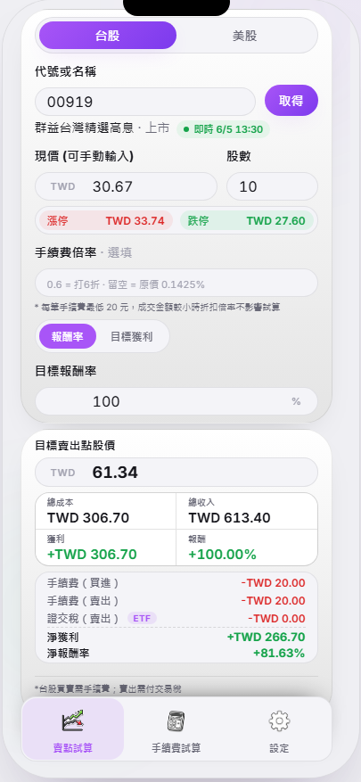

<div align="right">

**English** · [繁體中文](README.md)

</div>

# Sell Signal — Know your exit before you enter.

~ Pick a stock · Set a goal · See the price you should sell at ~

## Features
- Sell-target calculator: enter price, shares, and a goal to get the exact sell price
- Two goal modes: target **% return** or target **$ profit** (each remembers its own value)
- Live price fetch for **TW stocks** (TWSE MIS) and **US stocks** (Yahoo Finance)
- US pre-market / after-hours tag: shows the current extended-session price next to the company name (display only, does not affect the calculation)
- Search by code or company name (e.g. `2330` or `台積電`, `TSLA` or `Tesla`)
- Taiwan fee modeling: broker commission (0.1425%, NT$20 floor, optional 折數 multiplier) + securities transaction tax, ETF-aware
- Daily price-limit display (漲停 / 跌停, ±10%) for the TW market
- Live-vs-previous-close freshness tag with the trade timestamp in Taipei time
- Commission-discount reverse calculator: enter what you paid, see the 折數 you actually got
- Bilingual UI (English / 繁體中文) with auto-detection and persistence
- Mobile-first dark editorial layout with a persistent bottom nav

## Quick Start Example
After running the app locally, the **計算機 (Calculator)** tab opens by default:

> Example: TSLA at `$415`, holding `10` shares, want `+10%` → sell at **`$456.50`**.

1. Pick a market (台股 / 美股), type a code or name, and press **取得 (Fetch)** to pull a live price.
2. Enter how many shares you hold and choose a goal mode (報酬率 % or 目標獲利 $).
3. The right panel shows the **target sell price**, total cost/revenue, profit, and for TW a full commission + tax breakdown with net profit.

Switch tabs from the bottom nav: **手續費 (Discount)** reverse-calculates your broker discount, and **設定 (Settings)** holds language, about, and bug-report info.

## Use Case

**Example 1: Timing the sell of a TW dividend-ETF holding**



1. On the **賣點試算 (Sell-target)** tab at the bottom of the home page, enter a TW stock code or name. For example `00919` (Capital Taiwan Select High Dividend), then press **取得 (Fetch)**. The app pulls the current price automatically; if the market is closed or the price looks wrong, you can type the current price by hand. Share count is always entered manually.
2. **Commission multiplier**: TW trades carry a commission multiplier, which you can work out on the **手續費試算 (Discount)** tab. For a 40% deal enter `0.4`; leave it blank for the full rate. (Commission has a NT$20 per-trade minimum, so the multiplier has no effect on small amounts.)
3. **Target return / profit**: Type the return or profit you want. For example a `10` (%) return, or a `10000` (TWD) target profit.
4. **Target sell price**: The panel below instantly shows your optimal sell price, along with total cost, total revenue, profit, and return (%). It also itemizes the buy/sell commission and securities transaction tax, then gives your net profit and net return.

## Tech Stack
- **React 18** + **Vite 6** (single-page web app, no backend)
- Live TW data via **TWSE MIS** (real-time quote + limits) and **TWSE OpenAPI** (name→code list)
- Live US data via **Yahoo Finance** v8 chart + v1 search
- **Vite dev proxy** with a public **CORS-proxy fallback chain** for static builds

## Running Locally
```bash
npm install      # first time only
npm run dev      # starts dev server at localhost:5173 (auto-opens)
npm run build    # production build → dist/
npm run preview  # preview production build at localhost:5173
```

## Desktop Shortcut (Windows)
If you would rather not `cd` into the project and run `npm run dev` every time, you can put a one-click launcher on your desktop.

**Option 1: Batch file (simplest)**

Create `SellSignal Dev.bat` on your desktop with the following content (swap the path for your own project location):
```bat
@echo off
title SellSignal Dev Server
cd /d "C:\path\to\SellSignal"

if not exist "node_modules" (
    echo node_modules not found. Running npm install ...
    call npm install
)

echo Starting dev server ^(npm run dev^) ...
call npm run dev

echo.
echo Dev server stopped. Press any key to close.
pause >nul
```
Double-clicking it changes into the project directory, installs dependencies if needed, and starts the Vite dev server. The `/d` flag on `cd /d` switches both drive and directory, so it works even if the project lives on another drive.

**Option 2: Shortcut with an icon (`.lnk`)**

A `.lnk` shortcut can carry a custom icon, but Windows icons only accept the `.ico` format (a `.png` will not work directly). This project ships `make-shortcut.ps1`, which converts `public/stock.png` into a multi-size `.ico` (16 / 32 / 48 / 256 px) and creates a desktop shortcut pointing at the `.bat` above:
```powershell
powershell -ExecutionPolicy Bypass -File make-shortcut.ps1
```
Adjust the `$projectDir` path at the top of the script for your environment before running. The generated `SellSignal.ico` is local-only and is listed in `.gitignore`, so it stays out of version control.

> If the icon does not update right away, that is the Windows icon cache. Refresh the desktop (F5) or restart File Explorer.

## Project Structure
```
stock-calculator/
├─ src/
│  ├─ main.jsx                 # React entry (createRoot) + styles.css import
│  ├─ App.jsx                  # Root: state, market/lang prefs, calc orchestration
│  ├─ styles.css               # Full design system (tokens, layout, components)
│  ├─ lib/
│  │  ├─ calculate.js          # Core sell-target math (% / $ modes)
│  │  ├─ twFees.js             # TW commission + securities tax, ETF detection
│  │  ├─ feeDiscount.js        # Reverse-calc the broker 折數 from a paid fee
│  │  ├─ priceLimits.js        # TWSE ±10% daily limit (漲停/跌停)
│  │  ├─ fetchPrice.js         # Market-aware price fetcher (TW + US) w/ proxy chain
│  │  ├─ i18n.js               # en/zh strings + language/market detection
│  │  └─ tw-stocks.json        # Bundled fallback list (~85 top TW listings)
│  └─ components/
│     ├─ BottomNav.jsx         # Persistent Calculator · Discount · Settings nav
│     ├─ FeeDiscountPage.jsx   # 手續費 discount reverse calculator
│     └─ SettingsPage.jsx      # Language, About, Bug Report, App Version
│
├─ public/
│  ├─ stock.png                # Calculator tab icon
│  ├─ calculator.png           # Discount tab icon
│  ├─ settings.png             # Settings tab icon
│  └─ logo.png                 # Brand logo (shown in Settings → About)
│
├─ index.html
├─ vite.config.js              # Dev proxies for MIS / TWSE / Yahoo
├─ package.json
└─ README.md
```

## Tabs
| Tab | Component | Description |
|---|---|---|
| 計算機 / Calculator | `App` (calc view) | Live price fetch, sell-target math, TW fee breakdown |
| 手續費 / Discount | `FeeDiscountPage` | Reverse-calculate broker commission discount (折數) |
| 設定 / Settings | `SettingsPage` | Language toggle, About, Bug Report, App Version |

## Data Sources
| Source | Purpose |
|---|---|
| TWSE MIS | Real-time TW quote, 漲跌停, board (上市/上櫃), industry |
| TWSE OpenAPI | Full listed-stock catalog for name→code lookup |
| Yahoo Finance (v8 chart) | US real-time price + currency + exchange |
| Yahoo Finance (v1 search) | US symbol resolution from a company name |

## Disclaimer
- Yahoo prices can be 15-20 minutes delayed depending on the exchange.
- This is an educational calculator, **not** investment advice.

## Roadmap (Work in Progress)
- **Price-alert push (到價通知)** — push a notification when the price hits the user's target return/profit.
- **Exchange-accurate TW price limits** — replace the ±10% approximation with the TWSE tick-size table (`priceLimits.pickTick`) and the official `limits` already returned by `fetchPrice`.

## Changelog

### 2026-06-04
- Added a "Use Case" section walking through a TW dividend-ETF sell-timing example.
- Added a "NT$20 minimum per trade" note to the commission-multiplier field, explaining why the multiplier has no effect on small amounts.
- Code cleanup: onFetch now uses a stable useCallback, and dead code was removed.

### 2026-06-03
- Minor docs touch-up.
- Show TW or ET Date in the stock status section

### 2026-06-02
- Added a Light appearance theme: switch between light and dark backgrounds in Settings. Defaults to dark and remembers your preference.
- Fixed several issues and polished details: improved the freshness of TW intraday quotes, corrected the quote-source label, and made other small UX refinements.

### 2026-05-31
- Initial release: React + Vite scaffold, Yahoo price fetch, two goal modes, editorial dark UI.

---

## 👤 Author
Ricy Hsu

Contact: Email (mailto:fydeszzz@gmail.com)

---

## 📅 Last Updated
June 4, 2026
